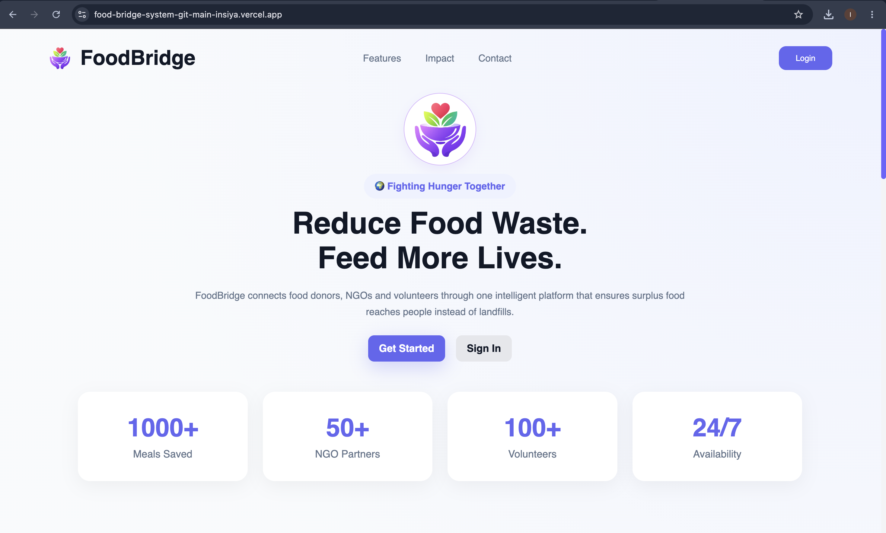
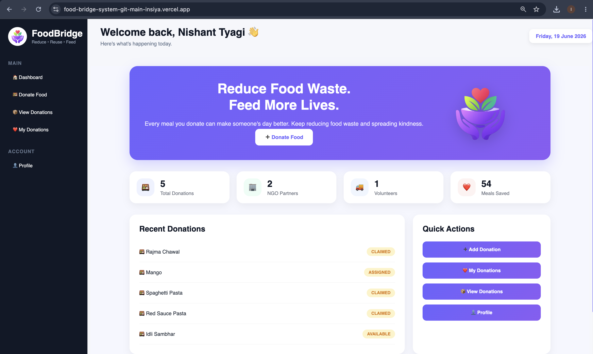
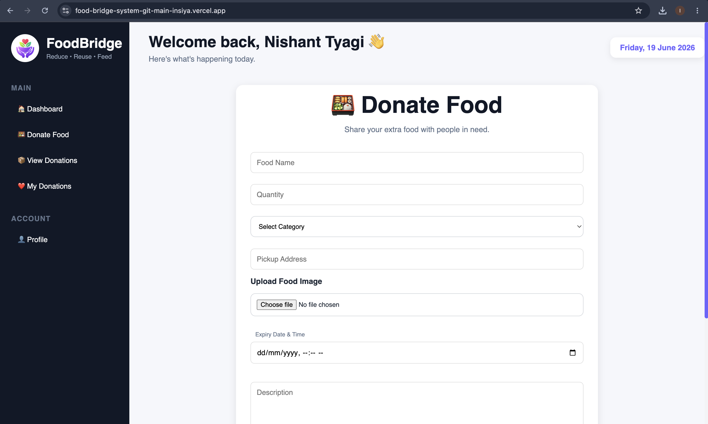
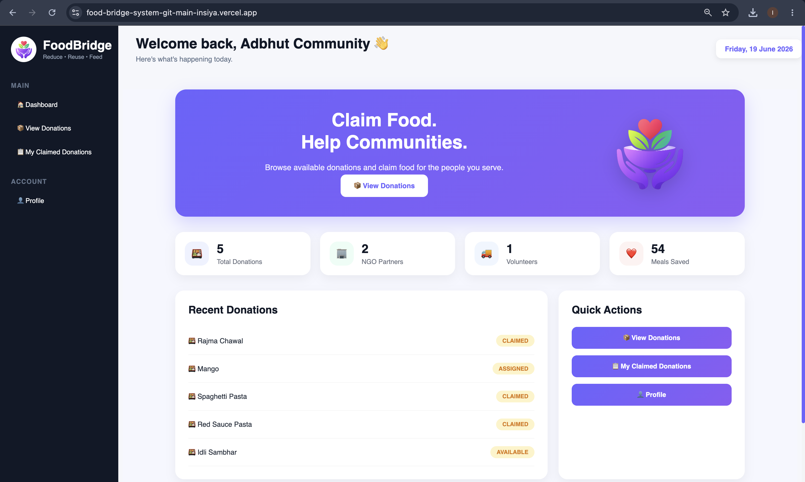
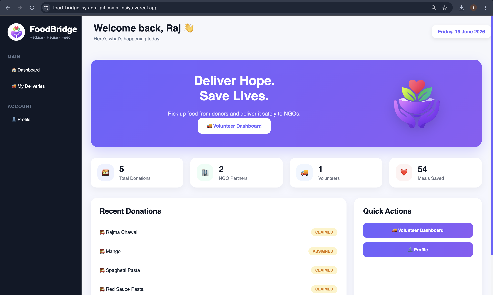
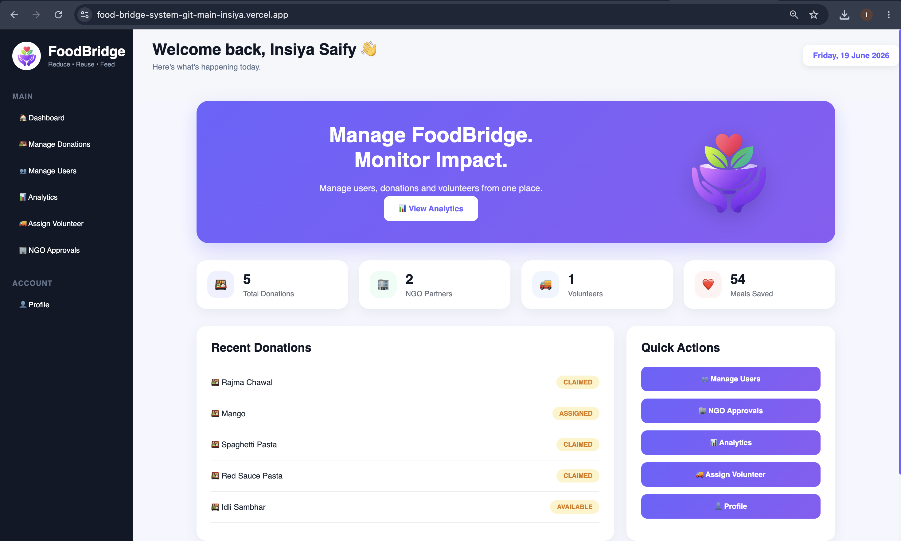

# 🍱 FoodBridge System

## Overview

FoodBridge System is a full-stack web application designed to reduce food waste by connecting **Donors**, **NGOs**, **Volunteers**, and **Administrators** on a single platform. The system enables donors to contribute surplus food, NGOs to claim donations, volunteers to deliver food, and administrators to manage the complete donation workflow efficiently.

---

# 🚀 Live Demo

| Service              | Link                                                  |
| -------------------- | ----------------------------------------------------- |
| Frontend (Vercel)    | https://food-bridge-system-git-main-insiya.vercel.app |
| Backend API (Render) | https://foodbridgesystem.onrender.com                 |

---

# 🎯 Project Highlights

* Multi-role system (Donor, NGO, Volunteer, Admin)
* JWT Authentication & Authorization
* PostgreSQL Database Integration
* Cloudinary Image Upload Support
* Email Notifications using Gmail SMTP
* NGO Approval Workflow
* Volunteer Assignment & Delivery Tracking
* Full-stack Deployment using Vercel and Render

---

# Functionalities

## Donor Functionalities

* Register and Login
* Donate Food
* Upload Food Images
* View Donation History
* Edit Profile
* Change Password
* Receive Email Notifications

## NGO Functionalities

* Register NGO Account
* Wait for Admin Approval
* Claim Available Donations
* View Claimed Donations
* Receive Delivery Notifications

## Volunteer Functionalities

* Login and Access Dashboard
* View Assigned Deliveries
* Mark Deliveries as Completed

## Admin Functionalities

* Approve / Reject NGO Accounts
* View All Donations
* Assign Volunteers
* Manage Users
* Monitor Dashboard Statistics

---

# Technologies Used

| Category      | Technologies                                     |
| ------------- | ------------------------------------------------ |
| Frontend      | React.js, Vite, Axios, React Toastify            |
| Backend       | Spring Boot, Spring Security, JWT Authentication |
| Database      | PostgreSQL (Neon)                                |
| Image Storage | Cloudinary                                       |
| Email Service | Gmail SMTP                                       |
| Deployment    | Vercel, Render                                   |
| Tools         | IntelliJ IDEA, Postman, GitHub                   |

---

# Architecture

The system follows a layered architecture:

```text
React Frontend
       │
       ▼
Spring Boot REST APIs
       │
       ▼
PostgreSQL Database
       │
       ▼
Cloudinary Image Storage
```

---

# Screenshots

## Home Page



## Donor Dashboard



## Donate Food Page



## NGO Dashboard



## Volunteer Dashboard



## Admin Dashboard



---

# Setup Instructions

## Prerequisites

* Java 21
* Node.js
* PostgreSQL
* IntelliJ IDEA / VS Code
* Postman

---

## Clone Repository

```bash
git clone https://github.com/insiya21/FoodBridgeSystem.git
cd FoodBridgeSystem
```

---

## Backend Setup

1. Configure PostgreSQL database.
2. Update database credentials in `application.properties`.
3. Configure Gmail SMTP credentials.
4. Configure Cloudinary credentials.
5. Run the Spring Boot application.

```bash
./mvnw spring-boot:run
```

Backend will run on:

```text
http://localhost:8080
```

---

## Frontend Setup

```bash
cd frontend
npm install
npm run dev
```

Frontend will run on:

```text
http://localhost:5173
```

---

# Environment Variables

```env
DATABASE_URL=
DATABASE_USERNAME=
DATABASE_PASSWORD=

MAIL_USERNAME=
MAIL_PASSWORD=

CLOUDINARY_CLOUD_NAME=
CLOUDINARY_API_KEY=
CLOUDINARY_API_SECRET=
```

---

# Folder Structure

```text
FoodBridgeSystem/
│
├── frontend/
│   ├── src/
│   ├── public/
│   └── package.json
│
├── src/
│   └── main/
│       ├── java/
│       │   └── com.insiya.foodbridgesystem/
│       │       ├── controller/
│       │       ├── service/
│       │       ├── repository/
│       │       ├── entity/
│       │       ├── dto/
│       │       ├── security/
│       │       └── config/
│       │
│       └── resources/
│           └── application.properties
│
├── screenshots/
├── README.md
├── pom.xml
└── Dockerfile
```

---

# API Endpoints

## Authentication APIs

| Method | Endpoint                  | Description    |
| ------ | ------------------------- | -------------- |
| POST   | /api/auth/register        | Register User  |
| POST   | /api/auth/login           | Login User     |
| POST   | /api/auth/forgot-password | Send OTP       |
| POST   | /api/auth/reset-password  | Reset Password |

---

## Donation APIs

| Method | Endpoint                    | Description          |
| ------ | --------------------------- | -------------------- |
| POST   | /api/donations              | Create Donation      |
| GET    | /api/donations              | View All Donations   |
| GET    | /api/donations/stats        | Dashboard Statistics |
| PUT    | /api/donations/claim/{id}   | Claim Donation       |
| PUT    | /api/donations/assign/{id}  | Assign Volunteer     |
| PUT    | /api/donations/deliver/{id} | Mark Delivered       |
| DELETE | /api/donations/{id}         | Delete Donation      |

---

## Admin APIs

| Method | Endpoint                | Description       |
| ------ | ----------------------- | ----------------- |
| GET    | /api/admin/pending-ngos | View Pending NGOs |
| PUT    | /api/admin/approve/{id} | Approve NGO       |
| PUT    | /api/admin/reject/{id}  | Reject NGO        |

---

## User APIs

| Method | Endpoint                   | Description         |
| ------ | -------------------------- | ------------------- |
| GET    | /api/users/{id}            | Get User Details    |
| PUT    | /api/users/{id}            | Update User Profile |
| PUT    | /api/users/change-password | Change Password     |

---

# Testing with Postman

1. Open Postman.
2. Import or create requests using the API endpoints listed above.
3. Test registration and login APIs.
4. Test donation creation and claiming workflow.
5. Test volunteer assignment and delivery completion.
6. Verify email notifications and OTP functionality.

---

# Future Enhancements

* Real-Time Notifications
* Google Maps Integration
* Mobile Application
* Analytics Dashboard
* AI-Based Food Matching
* Real-Time Chat Support

---

# Author

**Insiya Saify**

GitHub: https://github.com/insiya21
